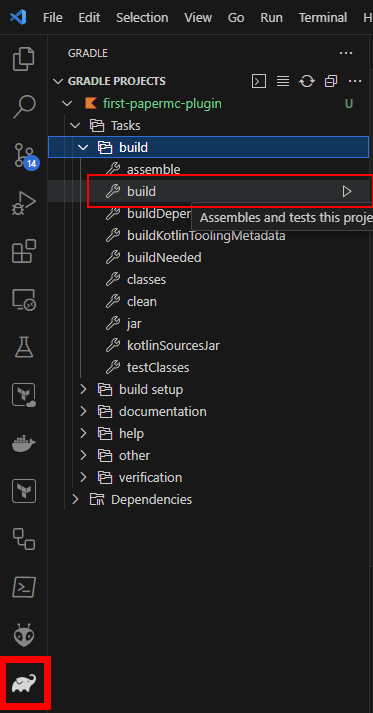
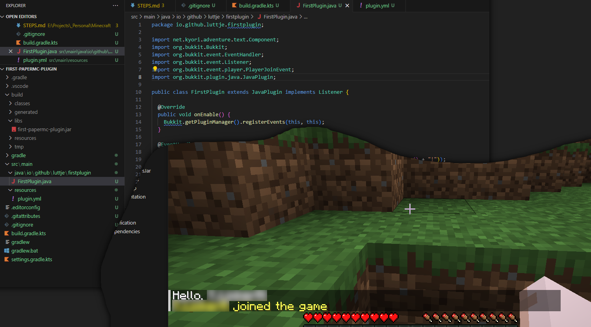

# ⛏ Creating a Minecraft Paper Plugin in VSCode

In this guide we'll show you how to create a Minecraft Paper plugin in VSCode on **Windows**. The plugin in this repository is the result of following the steps in this guide.

**The guide below involves:**

1. Setting up your Development Environment with:
    - [Java 21](https://docs.papermc.io/misc/java-install)
    - VSCode Extensions:
      - [Extension Pack for Java](https://marketplace.visualstudio.com/items?itemName=vscjava.vscode-java-pack)
      - [Kotlin Extension](https://marketplace.visualstudio.com/items?itemName=mathiasfrohlich.Kotlin)
      - [Gradle for Java](https://marketplace.visualstudio.com/items?itemName=vscjava.vscode-gradle)
    - [Gradle](https://docs.gradle.org/current/userguide/installation.html#windows_installation)

2. Setting up a new project with Gradle (`gradle init`)

3. Downloading the [PaperMC server](https://docs.papermc.io/paper/getting-started#downloading-paper)

4. Setting up the server with your plugin.

## 🐱‍💻 Setting up your Development Environment

For the following steps we assume you've installed [VSCode](https://code.visualstudio.com/).

1. Install the following extensions in VSCode:

    - [Extension Pack for Java](https://marketplace.visualstudio.com/items?itemName=vscjava.vscode-java-pack)
    - [Kotlin Extension](https://marketplace.visualstudio.com/items?itemName=mathiasfrohlich.Kotlin)
    - [Gradle for Java](https://marketplace.visualstudio.com/items?itemName=vscjava.vscode-gradle)

2. [Install Java 21](https://docs.papermc.io/misc/java-install) as per the PaperMC documentation.

3. Verify that Java is installed by running `java -version` in your terminal. You should see something like this:

    ```bash
    java -version
    openjdk version "21.0.2" 2024-01-16 LTS
    OpenJDK Runtime Environment Corretto-21.0.2.13.1 (build 21.0.2+13-LTS)
    OpenJDK 64-Bit Server VM Corretto-21.0.2.13.1 (build 21.0.2+13-LTS, mixed mode, sharing)
    ```

4. [Install gradle](https://docs.gradle.org/current/userguide/installation.html#windows_installation) as per the Gradle documentation. In short:

    1. Download the latest version of Gradle from the [Gradle website](https://gradle.org/releases/), currently `v8.6`. Choose the `binary-only` download.
    2. Extract the downloaded file to a directory on your computer, e.g. `C:\Gradle\gradle-8.6`.
    3. Add Gradle to PATH by opening your start menu and searching 'Environment Variables'
    4. Click on 'Edit the System Environment Variables', then 'Environment Variables' in the window that pops up.
    5. In the 'System Variables' section, click on 'Path' and then 'Edit'.
    6. Click 'New' and add the path to the `bin` directory of your Gradle installation, e.g. `C:\Gradle\gradle-8.6\bin`.

5. Verify that Gradle is installed by running `gradle -v` in your terminal. You should see something like this:

    ```bash
    gradle -v

    ------------------------------------------------------------
    Gradle 8.6
    ------------------------------------------------------------

    Build time:   2024-02-02 16:47:16 UTC
    Revision:     d55c486870a0dc6f6278f53d21381396d0741c6e

    Kotlin:       1.9.20
    Groovy:       3.0.17
    Ant:          Apache Ant(TM) version 1.10.13 compiled on January 4 2023
    JVM:          21.0.2 (Amazon.com Inc. 21.0.2+13-LTS)
    OS:           Windows 10 10.0 amd64
    ```

**You're now ready to start creating your first Minecraft Paper plugin project!**

## 📦 Setting up a new project with Gradle

1. Create a new folder for your project, e.g. `my-first-plugin` in your `C:\Projects` folder

2. Open the folder in VSCode

3. Open a terminal in VSCode and run the following command to create a new Gradle project:

    ```bash
    gradle init --type basic --dsl kotlin
    ```

4. Follow the prompts to create the project. You can use the following settings:

    - Project name: `my-first-plugin`
    - Generate build using new APIs and behavior (some features may change in the next minor release)? (default: no): `no`

5. Your project should now be set up with:

    - A `build.gradle.kts` file
    - A `settings.gradle.kts` file
    - A `gradle` folder with some files
    - A `gradlew` and `gradlew.bat` file
    - `.gitattributes` and `.gitignore` files

6. [Follow the steps in project setup](https://docs.papermc.io/paper/dev/project-setup) from the official PaperMC documentation, which we'll summarize and expand on in the following steps:

7. Add the dependencies to the `build.gradle.kts` file:

    ```kotlin
    repositories {
        mavenCentral()
        maven("https://repo.papermc.io/repository/maven-public/")
    }

    dependencies {
        compileOnly("io.papermc.paper:paper-api:1.20.4-R0.1-SNAPSHOT")
    }

    java {
        toolchain.languageVersion.set(JavaLanguageVersion.of(17))
    }
    ```

8. In addition, add this to the top of the `build.gradle.kts` file:

    ```kotlin
    plugins {
      kotlin("jvm") version "1.9.23"
    }
    ```

9. Setup the `src` directory structure:

    - Create a new folder called `src/main/` in your project folder
    - Choose a unique name for your plugin (e.g: `io.github.myusername.firstplugin`) and create that folder structure inside `src/main/`
    - Inside the `io.github.myusername.firstplugin` folder, create the entry point for your plugin, e.g. `FirstPlugin.java`:

      ```java
      package io.github.myusername.firstplugin;

      import net.kyori.adventure.text.Component;
      import org.bukkit.Bukkit;
      import org.bukkit.event.EventHandler;
      import org.bukkit.event.Listener;
      import org.bukkit.event.player.PlayerJoinEvent;
      import org.bukkit.plugin.java.JavaPlugin;

      public class FirstPlugin extends JavaPlugin implements Listener {

        @Override
        public void onEnable() {
          Bukkit.getPluginManager().registerEvents(this, this);
        }

        @EventHandler
        public void onPlayerJoin(PlayerJoinEvent event) {
          event.getPlayer().sendMessage(Component.text("Hello, " + event.getPlayer().getName() + "!"));
        }

      }
      ```

10. Setup a `resources` directory inside the `src/main` directory.

11. Create a `plugin.yml` file inside `src/main/resources` with content like this:

    ```yaml
    name: FirstPlugin
    version: 0.1.0
    main: io.github.myusername.firstplugin.FirstPlugin
    description: An example plugin
    author: Luttje
    website: https://github.com/luttje
    api-version: '1.20'
    ```

    - You can choose your own name, version, description, author and website.
    - Make sure the `main` field matches the package and class name of your plugin entry point.
    - See [the PaperMC documentation for more information on the `plugin.yml` file](https://docs.papermc.io/paper/dev/plugin-yml).

**Your project should now be set up and ready to build!**

## 🔨 Build the plugin

1. In VSCode go to Gradle > `plugin-name-here` > Tasks > build and run the build task:

    

2. The build/libs folder should now contain a .jar file with the name of the project. This is your plugin!

## 🚀 Setting up the server with your plugin

1. If you don't have PaperMC yet, [download the last PaperMC](https://docs.papermc.io/paper/getting-started#downloading-paper)

2. Place it in a folder somewhere. We'll call that folder `server`

3. Use the [Startup script generator](https://docs.papermc.io/misc/tools/start-script-gen) to generate a startup script

4. The startup script may look like this, add it to a `.bat` file in your `server` folder:

    ```bash
    # Replace this with the startup script you generated
    java -Xmx4096M -Xms4096M -jar paper-1.20.4-451.jar --nogui
    ```

5. The server will start and shut down the first time you run it. This is normal. Set `eula=true` in `eula.txt` to accept the EULA. This is required to start the server.

6. A plugins folder has been created in the server folder. Place the .jar file from the build/libs folder in the plugins folder.

7. Restart the server and the plugin should be loaded.

When you join the server, you should see a message in the chat from your plugin!



**🎉 Congratulations! You've created your first Minecraft Paper plugin in VSCode!**
